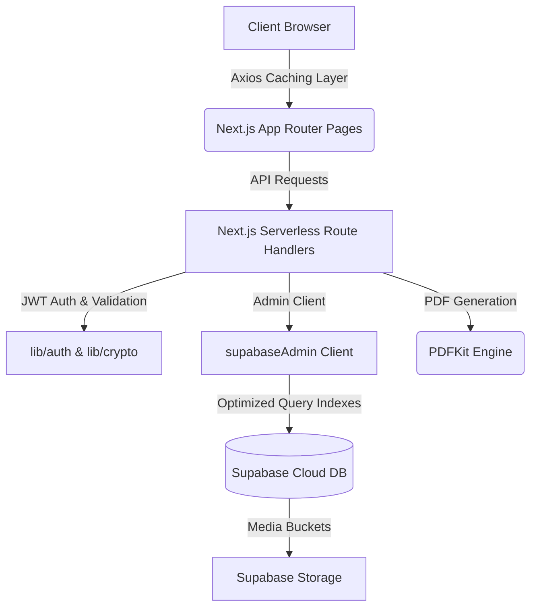

<div align="center">
  
# 🏢 Enterprise Property Management System (SaaS)

[](https://nextjs.org/)
[](https://react.dev/)
[](https://www.typescriptlang.org/)
[](https://supabase.com/)
[](https://tailwindcss.com/)

**A premium, high-performance Property Management SaaS built with Next.js App Router API Handlers and Supabase (PostgreSQL). Optimized for cost, efficiency, and real-time operations.**

[Report Bug](https://github.com/mohamedfaisal-dev/Property-Management/issues) · [Request Feature](https://github.com/mohamedfaisal-dev/Property-Management/issues)

</div>

---

## 📖 Overview

The **Enterprise Property Management System** is a production-grade, highly-responsive SaaS application designed to streamline real estate operations. Engineered on a modern **Next.js serverless architecture** backed by **Supabase (PostgreSQL)**, this platform manages properties, tracks tenants, automates billing workflows, and displays real-time cashflow analytics with state-of-the-art client-side and database-level optimizations.

### ⚡ Performance & Caching Engine
To ensure high speed and cost efficiency (minimizing Supabase API call volume and serverless execution times), the system implements:
*   **Browser-Side Request Caching**: An advanced caching layer built on Axios in `src/api.ts` with a **30-second TTL** for read-heavy operations (`getDashboardSummary`, `getAnalyticsOverview`, property/tenant/bill/expense lists).
*   **Intelligent Cache Eviction**: Auto-evicts corresponding lists and active dashboard/analytics keys whenever data mutations (creation, updates, deletions, payments) are executed.
*   **Postgres-Level Query Indexes**: Optimizations applied to foreign keys and filtered columns (`admin_id`, `property_id`, `tenant_id`, `month`, `status`) to avoid full-table scans.

---

## ✨ Core Features

*   **🏢 Portfolio Management**: Complete CRUD operations for properties, supporting rich media uploads directly into Supabase Storage, location tracking, and financial overhead metrics.
*   **👥 Tenant Lifecycle Management**: Onboard and track tenant leases, security deposits, monthly rent, and checkout processes.
*   **💳 Automated Invoicing & PDF Receipts**: Chronologically scheduled billing engine with dynamic, high-performance PDF receipts generated via `PDFKit` streaming directly to client browsers.
*   **📊 Real-time Financial Analytics**: Beautiful dashboards utilizing `Recharts` to display income vs expenses, budget variances, payment compliance rates, and expense category breakdowns.
*   **🔑 Secure RBAC & Local Dev Autocomplete**: Implements JSON Web Tokens (JWT) for secure authentication. For easier local development, a clean **Development Autofill** panel is integrated on the login screen.

---

## 🏗️ System Architecture

This repository uses a serverless Architecture using Next.js App Router Route Handlers as backend APIs, completely eliminating the need for standalone backend servers.



### 🧩 Architectural Highlights
*   **Serverless APIs**: Custom REST handlers in `src/app/api/*` that load dynamically, keeping hosting resource overhead low.
*   **Strict Type-Safety**: 100% strict TypeScript mapping across pages, components, and data endpoints.
*   **Database Scaling**: Designed with indexes that scale queries to $O(\log N)$ rather than $O(N)$ table scans.

---

## 💻 Tech Stack

### Frontend & Styling
*   **Core Framework**: Next.js 16.2.9 (App Router)
*   **View Engine**: React 19.2.7
*   **Language**: TypeScript 6.0.3
*   **Design System**: Tailwind CSS v4.0 (Utilizing PostCSS architecture)
*   **Icons**: Lucide React
*   **Charts**: Recharts

### Serverless Backend & DB
*   **Client Core**: Axios 1.17.0 (with Custom Caching TTL Middleware)
*   **Cloud Database**: Supabase (PostgreSQL)
*   **Authentication**: JSON Web Token (JWT) & BcryptJS
*   **PDF Compiler**: PDFKit 0.19.1
*   **Scheduler**: Node-Cron

---

## 🚀 Getting Started

### Prerequisites
*   Node.js (v20 or higher)
*   A Supabase project with table schemas created.

### 1. Clone the Repository
```bash
git clone https://github.com/mohamedfaisal-dev/Property-Management.git
cd Property-Management
```

### 2. Install Dependencies
```bash
npm install
```

### 3. Environment Setup
Create a `.env` file in the root directory:
```env
# Supabase Configuration
NEXT_PUBLIC_SUPABASE_URL=https://your-project-id.supabase.co
NEXT_PUBLIC_SUPABASE_ANON_KEY=your-anon-public-key
SUPABASE_SERVICE_ROLE_KEY=your-service-role-secret-key

# JWT Authentication
JWT_SECRET=your-custom-jwt-secret-key-string
JWT_EXPIRES_IN=24h
```

### 4. Database Schema Setup
1. Copy the content of [supabase_schema.sql](file:///c:/Users/moham/OneDrive/Desktop/Property-Management/scripts/db/supabase_schema.sql) and execute it in your **Supabase SQL Editor** to create database tables and seed default administrator credentials.
2. To optimize database queries and cut down Supabase server usage billing, copy the statements from [supabase_indexes.sql](file:///c:/Users/moham/OneDrive/Desktop/Property-Management/scripts/db/supabase_indexes.sql) and execute them in your **Supabase SQL Editor** to construct the indexes.

### 5. (Optional) Create Development Admin
To create a custom developer admin credentials locally, configure your `.env` variables and run:
```bash
node scripts/db/create_faisal_admin.js
```

### 6. Run the Application
Start the Next.js development server:
```bash
npm run dev
```
Navigate to `http://localhost:3000` to view the SaaS dashboard.

---

## 🛡️ Security Implementations
*   **Query Index Sanity**: Database indexing on Supabase tables prevents timeout vectors and DDoS bottlenecks.
*   **Input Sanitization**: Client & server-side object validation via Joi schemas.
*   **State-of-the-Art Cryptography**: Secure passwords generated and compared using `bcryptjs` with salt-rounds factor of 12.
*   **Access Control (RBAC)**: Route Handlers verified using stateless JWT authentication checks.

---

## 👨‍💻 Author & Portfolio

**Mohamed Faisal**
*   **GitHub**: [@mohamedfaisal-dev](https://github.com/mohamedfaisal-dev)
*   **Portfolio**: [View My Work](#)
*   **LinkedIn**: [Connect with me](#)

---

<div align="center">
  <i>If you found this project helpful, please consider leaving a ⭐!</i>
</div>
