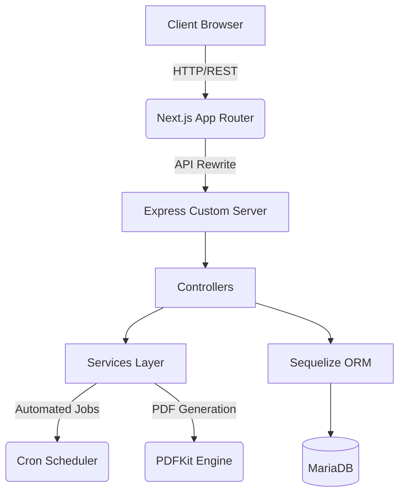

<div align="center">
  
# 🏢 Enterprise Property Management System

[](https://nextjs.org/)
[](https://react.dev/)
[](https://www.typescriptlang.org/)
[](https://expressjs.com/)
[](https://tailwindcss.com/)
[](https://mariadb.org/)

**A robust, fully integrated Full-Stack Application built with Next.js App Router and a Custom Express Server.**

[Report Bug](https://github.com/mohamedfaisal-dev/Property-Management/issues) · [Request Feature](https://github.com/mohamedfaisal-dev/Property-Management/issues)

</div>

---

## 📖 Overview

The **Enterprise Property Management System** is a sophisticated, production-grade web application designed to automate and streamline real estate operations. Engineered with a scalable **monolithic architecture** that seamlessly blends a **Next.js frontend** with an **Express.js backend**, this platform offers end-to-end management for properties, tenants, automated billing, and financial analytics.

This project was built from the ground up to demonstrate mastery of modern web architecture, strict type-safety, database relationship management, and automated background processes.

## ✨ Core Features

*   **🏢 Portfolio Management**: Complete CRUD operations for properties including rich media uploads, location tracking, and financial metrics.
*   **👥 Tenant Lifecycle Management**: End-to-end tenant tracking from onboarding and lease management to payment history and status monitoring.
*   **🤖 Automated Billing Engine**: Scheduled cron jobs that automatically generate monthly rent invoices (in French compliance formats) exactly when due.
*   **📄 Dynamic PDF Generation**: On-the-fly, high-performance generation of official receipts and bills using `PDFKit`, with immediate streaming capabilities.
*   **📊 Real-time Financial Analytics**: Interactive dashboards providing insights into total profits, pending bills, overdue payments, and portfolio ROI.
*   **🔐 Secure Authentication**: Robust session management and Role-Based Access Control (RBAC) ensuring data privacy.

---

## 🏗️ System Architecture

This repository employs a highly optimized architecture combining the best of Next.js SSR/SSG capabilities with a dedicated Express.js API—all within a single codebase.



### 🧩 Architectural Highlights
*   **Clean Architecture**: Separation of concerns enforced through isolated `Controllers`, `Models`, `Routes`, and `Services`.
*   **Strict Type-Safety**: 100% TypeScript coverage ensuring zero runtime type errors (`tsc --noEmit` verified).
*   **Service-Oriented Backend**: Heavy business logic (PDF generation, Cron tasks, Billing cycles) abstracted into dedicated, testable service classes.
*   **Industrial Code Quality**: Enforced via ESLint, strictly typed API boundaries, and unified error handling middleware.

---

## 💻 Tech Stack

### Frontend
*   **Framework**: [Next.js 15](https://nextjs.org/) (App Router)
*   **Library**: [React 19](https://react.dev/)
*   **Language**: [TypeScript 5.5](https://www.typescriptlang.org/)
*   **Styling**: [TailwindCSS](https://tailwindcss.com/)
*   **Icons**: [Lucide React](https://lucide.dev/)
*   **Charts**: [Recharts](https://recharts.org/)

### Backend
*   **Framework**: [Express.js](https://expressjs.com/) (Integrated into Next.js via catch-all routes)
*   **ORM**: [Sequelize](https://sequelize.org/)
*   **Database**: [MariaDB](https://mariadb.org/)
*   **Task Scheduling**: `node-cron`
*   **Document Generation**: `pdfkit`
*   **Security**: `helmet`, `cors`, `express-rate-limit`, `bcryptjs`

---

## 🚀 Getting Started

### Prerequisites
*   Node.js (v18 or higher)
*   MariaDB / MySQL Server installed and running

### 1. Clone the repository
```bash
git clone https://github.com/mohamedfaisal-dev/Property-Management.git
cd Property-Management
```

### 2. Install Dependencies
```bash
npm install
```

### 3. Environment Configuration
Create a `.env` file in the root directory based on `.env.example` (or use the following template):
```env
# Server
PORT=4002
NODE_ENV=development
SESSION_SECRET=your_super_secret_key

# Database
DB_HOST=localhost
DB_PORT=3306
DB_NAME=property_rental
DB_USER=root
DB_PASSWORD=your_password

# Frontend
NEXT_PUBLIC_API_BASE_URL=http://localhost:3000/api
```

### 4. Database Setup
Run the database migrations and seed scripts to establish the schema:
```bash
npm run setup:db
```
*(Alternatively, execute the SQL dump located in `scripts/db/property_rental.sql` directly into your MariaDB instance).*

### 5. Start the Application
Run the development server. This spins up both the Next.js frontend and the integrated Express backend:
```bash
npm run dev
```
Navigate to `http://localhost:3000` to view the application.

---

## 🔒 Security Measures
*   **XSS & CSRF Protection**: Implemented via `helmet` and modern React practices.
*   **Rate Limiting**: Defending against Brute Force and DDoS attacks using `express-rate-limit`.
*   **SQL Injection Prevention**: Parameterized queries enforced natively by the Sequelize ORM.
*   **Sanitized Uploads**: Secure multipart/form-data parsing via `multer` restricted to memory storage and strict file size limits.

---

## 👨‍💻 Author & Portfolio

**Mohamed Faisal**
*   **GitHub**: [@mohamedfaisal-dev](https://github.com/mohamedfaisal-dev)
*   **Portfolio**: [View My Work](#) *(Replace with your actual portfolio link)*
*   **LinkedIn**: [Connect with me](#) *(Replace with your actual LinkedIn link)*

> *"Driven by building scalable, industrial-grade software solutions that solve real-world problems."*

---

<div align="center">
  <i>If you found this repository helpful, please consider leaving a ⭐!</i>
</div>
